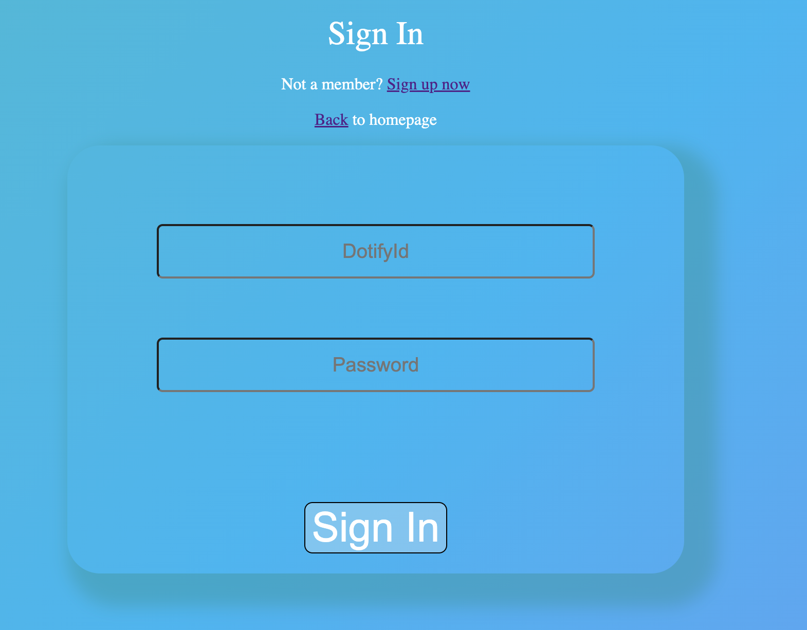

# dotify_frontend

Created By: Justin Junious

### **_Description_**

This application will be a music player service similar to Spotify. You will have the ability to register to the site.

From there music will become available to you. This will be playable and likeable.

You can choose to play music right from that page or you can like the music and create your own playlist of music.

You can also freely delete the playlist if you would like to create a new one.

### **_Technologies Used_**

- React
- Postgres
- Sequelize
- Node.js
- Express.js
- Javascript
- Html
- Css
- Heroku
- AWS
- React H5 audio player

#### [Heroku Deployment Backend](https://dotify.herokuapp.com/)

#### [Heroku Deployment Frontend](https://dotify-a.herokuapp.com/)

#### **_ERD, CHD & Trello_**

We used this diagram as a reference to understand user experience and how the database would connect/flow.
Feel free to modify this and make your own.

[Hierarchy & ERD](https://lucid.app/lucidchart/633e4ccb-ac2c-406e-b8b0-5c689a99b561/edit?beaconFlowId=ACE688B68C8B05D8&invitationId=inv_f887054e-6b1d-4ec8-ba9e-d346e1411f18&page=0_0#)

Here is a link to the [Trello Board](https://trello.com/invite/b/mKGbJMBE/ATTI6142ff4de250acc3d83cc2b3012d32d891723CD3/dotify-project). This is what I used to plan out how I will build this application.

### **_Getting Started_**

#### If you would like to customize what exist.

---

- Fork and Clone
- `npm install`
- `sequelize db:create`
- `sequelize db:migrate`
- `npm run dev`

#### If you would like to start from scratch follow these steps

### **Backend**

- Create a Repo
- `npm init -y`
- `touch server.js`
- `npm i pg sequelize express cors dotenv express bcrypt nodemon jsonwebtoken`
- `sequelize init`

### Middleware index.js

First store the `SALT_ROUNDS` and `APP_SECRET` variables to the `.env` file. Setting `SALT_ROUNDS` to 12 allows the hash to be extremely complex and touch to hack. The following functions are pretty straight-forward. The `hashPassword` function creates a hash password. The `comparePassword` function compares the `storedPassword` to the recieved password. After compaing passwords, we need to create a token. Hence the function, `createToken`. It simply creates a token. To verify the `JWT` tokens we created a function called `verifyToken` that essentially verifies the recieved token and if there is a match, then proceed. If there are no matches, then send an error message. The `stripToken` function is similar to the `verifyToken` but instead it `splits` the token to verify it.

### Models && Routes

After work on created your models you would like to have for each. In this project we have a User model that has full CRUD, a music model that is mostly used on the backend to add content for the user to interact with. On the backend this has CRD.

The last model is likedmusic. This is a through table that connects the liked music by the user so that we can create a playlist of personalized music. This table has CRD on the frontend for the user.

After making the backend you want to work on the front end.

---

### **FrontEnd**

- Create a separate repo
- `npx create-react-app <app-name>`
- `npm i react-router-dom react-h5-audio-player axios`

### How it works

Since the back-end and front-end are two different repositories. You need to deploy to Heroku transfer data from the back-end to the front-end. To actually connect the back to the front, you need to utilize `axios`.

You want to create a Services folder to hold all of your Api information and set up your variables to use for your routes and headers.

### React Audio Player

You want to make sure install this and import this in the files you would like to use. There are a lot of ways you can build this and you can reference [this](https://github.com/lhz516/react-h5-audio-player). This will help you configure the type of player you are looking for.

`mkdir controllers pages` in src.

After feel free to start to design your site as you please.

### **_Future Updates_**

- Add more music to fill out options
- Improve on look and feel of site
- Add react nav bar
- Add ability to add mulitple playlists
